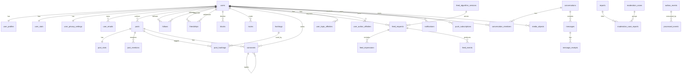

# ERD Summary

```mermaid
erDiagram
  users ||--|| user_profiles : has
  users ||--|| user_stats : has
  users ||--|| user_privacy_settings : has
  users ||--o{ user_emails : owns
  users ||--o{ posts : authors
  users ||--o{ follows : follower
  users ||--o{ follows : following
  users ||--o{ friendships : requester
  users ||--o{ friendships : addressee
  users ||--o{ blocks : blocker
  users ||--o{ mutes : muter
  posts ||--|| post_stats : has
  posts ||--o{ post_mentions : mentions
  posts ||--o{ post_hashtags : tagged
  hashtags ||--o{ post_hashtags : used_by
  posts ||--o{ comments : has
  comments ||--o{ comments : replies
  users ||--o{ comments : writes
  feed_algorithm_versions ||--o{ feed_requests : serves
  users ||--o{ feed_requests : requests
  feed_requests ||--o{ feed_impressions : includes
  feed_requests ||--o{ feed_events : produces
  users ||--o{ user_topic_affinities : has
  users ||--o{ user_author_affinities : has
  conversations ||--o{ conversation_members : has
  users ||--o{ conversation_members : joins
  conversations ||--o{ messages : contains
  messages ||--o{ message_receipts : has
  users ||--o{ notifications : receives
  users ||--o{ push_subscriptions : owns
  reports ||--o{ moderation_case_reports : links
  moderation_cases ||--o{ moderation_case_reports : groups
  users ||--o{ media_objects : owns
  outbox_events ||--o{ processed_events : consumed_by
```

The live schema keeps legacy text ID relations while UUID relations are populated additively. The ERD shows the target production relationship shape.

